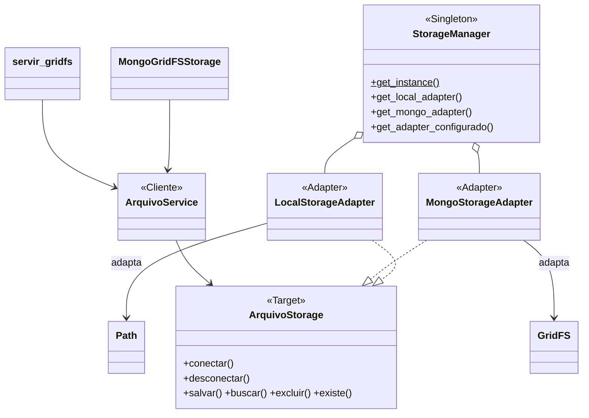
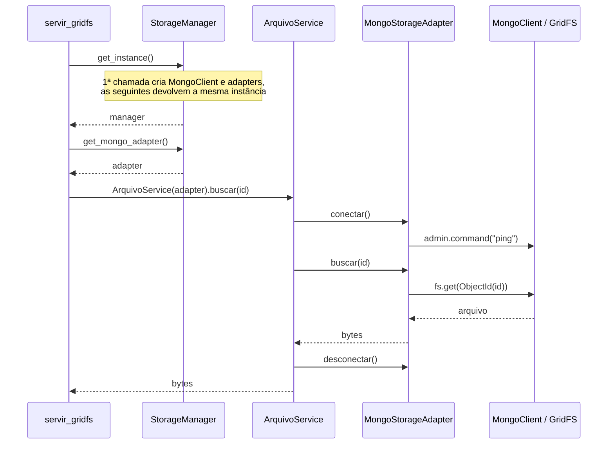

# Padrões de projeto no app `storage`

O app `storage` guarda os arquivos enviados pelo sistema (imagens e documentos dos `ImageField`/`FileField`), no sistema de arquivos local ou no MongoDB (GridFS). Ele segue a mesma estrutura da referência de sala, que combina **Singleton** e **Adapter**.

| Documento | Conteúdo |
|---|---|
| [singleton-storage.md](singleton-storage.md) | `StorageManager`: instância única que guarda os adapters |
| [adapter-storage.md](adapter-storage.md) | `ArquivoStorage` e seus adapters para disco local e GridFS |

> A referência (`docs/ref/*.java`) fica apenas na máquina local e está no `.gitignore`. Os trechos necessários foram copiados nos documentos acima.

## Como os dois padrões se encaixam

| Papel | Referência (Java) | Projeto (Python) |
|---|---|---|
| Singleton | `DatabaseManager` | `StorageManager` ([`storage/manager.py`](../storage/manager.py)) |
| Target do Adapter | `DataBaseAdapter` | `ArquivoStorage` ([`storage/interfaces.py`](../storage/interfaces.py)) |
| Adapters | `PostgresAdapter`, `MongoAdapter` | `LocalStorageAdapter`, `MongoStorageAdapter` |
| Adaptees | `PostgresClient`, `MongoClient` | `pathlib.Path` (disco), `pymongo.MongoClient` + `GridFS` |
| Cliente | `UsuarioService` | `ArquivoService` ([`storage/service.py`](../storage/service.py)) |
| Quem usa o cliente | `Main` | `MongoGridFSStorage`, `servir_gridfs` |



## Fluxo de uma requisição

Exemplo: o navegador pede uma imagem salva no GridFS (`GET /media/gridfs/<id>`, com `FILE_STORAGE=mongo`).



O equivalente em Python do `Main.java`:

```python
from storage.manager import StorageManager
from storage.service import ArquivoService

manager = StorageManager.get_instance()

arquivos_locais = ArquivoService(manager.get_local_adapter())
arquivos_mongo  = ArquivoService(manager.get_mongo_adapter())

arquivos_locais.salvar("documentos/contrato.pdf", conteudo)
arquivos_mongo.salvar("documentos/contrato.pdf", conteudo)
```

## Configuração

Definida em [`digicar/settings.py`](../digicar/settings.py) por variáveis de ambiente:

| Variável | Padrão | Uso |
|---|---|---|
| `FILE_STORAGE` | `local` | `local` usa o `FileSystemStorage` do Django; `mongo` troca o backend padrão para `MongoGridFSStorage`. Também define o retorno de `get_adapter_configurado()` |
| `MONGO_URI` | `mongodb://localhost:27017` | URI do `MongoClient` criado pelo `StorageManager` |
| `MONGO_DATABASE` | `digicar` | banco usado pelo GridFS |
| `MEDIA_ROOT` | `<projeto>/media` | diretório base do `LocalStorageAdapter` |

O `StorageManager` lê essas configurações **uma única vez**, na primeira chamada de `get_instance()`. Depois de alterá-las, reinicie a aplicação.

## Testes

```bash
python manage.py test core
```

Os testes do storage ficam em [`core/tests.py`](../core/tests.py): `StorageManagerTests`, `ArquivoServiceTests`, `ArquivoStorageTests` e `MongoStorageAdapterTests`. O Mongo é simulado com *mocks*, então não é preciso ter um MongoDB rodando.
