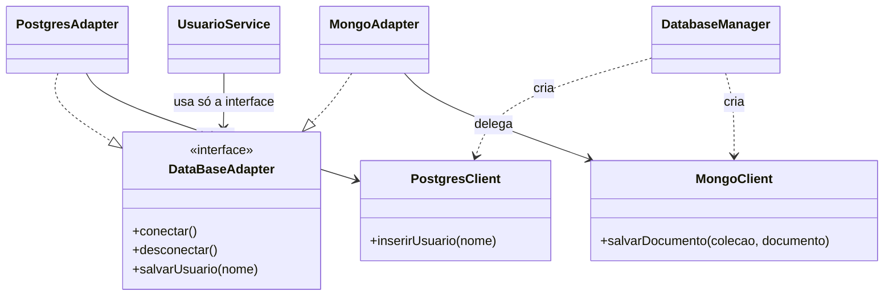
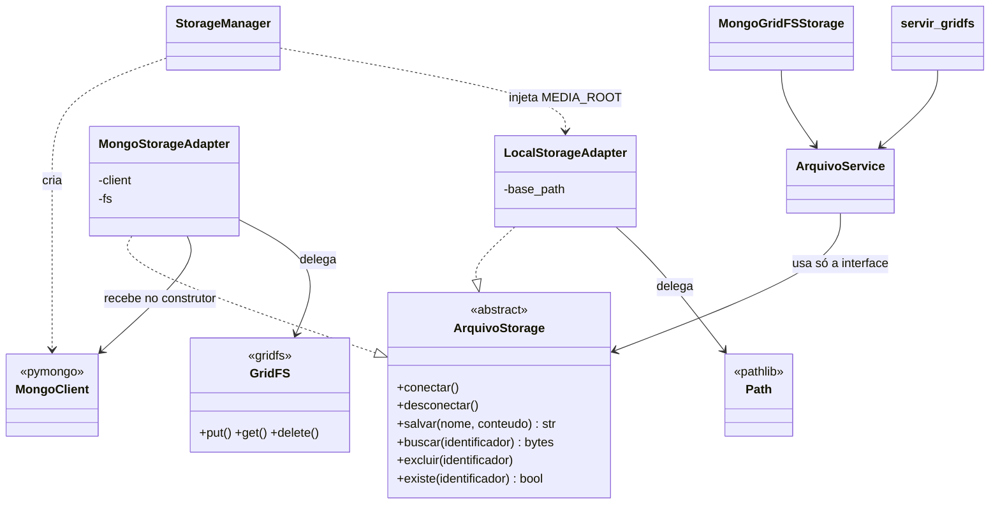

# Adapter no app `storage`

Este documento compara o Adapter do app `storage` com a referência de sala (`docs/ref/DataBaseAdapter.java`, `PostgresAdapter.java`, `MongoAdapter.java`, `PostgresClient.java`, `MongoClient.java` e `UsuarioService.java`) e registra o que foi alterado para o projeto seguir a mesma estrutura.

> A pasta `docs/ref/` fica apenas na máquina local (está no `.gitignore`). Por isso os trechos da referência aparecem copiados aqui.
>
> Veja também: [Singleton no app `storage`](singleton-storage.md) e a [visão geral](README.md).

**Status:** implementado. As seções 2 e 3 descrevem o estado **anterior** e ficam como registro da análise.

---

## 1. O Adapter na referência

O Adapter converte a interface de uma classe (o **Adaptee**) na interface que o cliente espera (o **Target**). Assim, classes com APIs incompatíveis passam a ser usadas do mesmo jeito.

Na referência há dois bancos com APIs diferentes:

```java
// Adaptees: APIs incompatíveis entre si
public class PostgresClient {
    public PostgresClient(String host, int porta, String database) { ... }
    public void conectar() { ... }
    public void desconectar() { ... }
    public void inserirUsuario(String nome) { ... }
}

public class MongoClient {
    public MongoClient(String host, int porta, String database) { ... }
    public void conectar() { ... }
    public void desconectar() { ... }
    public void salvarDocumento(String colecao, String documento) { ... }
}
```

A interface que o cliente conhece:

```java
// Target
public interface DataBaseAdapter {
    void conectar();
    void desconectar();
    void salvarUsuario(String nome);
}
```

Os adapters implementam o Target, recebem o Adaptee pelo construtor e traduzem as chamadas:

```java
public class MongoAdapter implements DataBaseAdapter {
    private final MongoClient mongoClient;

    public MongoAdapter(MongoClient mongoClient) {
        this.mongoClient = mongoClient;
    }

    public void conectar()    { mongoClient.conectar(); }
    public void desconectar() { mongoClient.desconectar(); }

    public void salvarUsuario(String nome) {
        mongoClient.salvarDocumento("auditoria", "{Evento: 'usuasio_criado', nome: '" + nome + "'}");
    }
}
// PostgresAdapter é igual, mas traduz salvarUsuario -> postgresClient.inserirUsuario(nome)
```

O cliente só conhece o Target e controla o ciclo de conexão:

```java
public class UsuarioService {
    private final DataBaseAdapter databaseAdapter;

    public UsuarioService(DataBaseAdapter dataBaseAdapter) {
        this.databaseAdapter = dataBaseAdapter;
    }

    public void cadastrarUsuario(String nome) {
        databaseAdapter.conectar();
        try {
            databaseAdapter.salvarUsuario(nome);
        } finally {
            databaseAdapter.desconectar();
        }
    }
}
```

Quem cria os Adaptees e os injeta nos adapters é o `DatabaseManager` (o Singleton).



### Características que definem o padrão na referência

| # | Característica | Onde aparece |
|---|---|---|
| A1 | Existe uma **interface alvo** (Target) que o cliente conhece | `DataBaseAdapter` |
| A2 | O Target tem o **ciclo de conexão** (`conectar`/`desconectar`) além da operação de negócio | `conectar()`, `desconectar()`, `salvarUsuario()` |
| A3 | Existem **Adaptees** com APIs incompatíveis entre si | `PostgresClient.inserirUsuario` × `MongoClient.salvarDocumento` |
| A4 | Cada adapter **implementa o Target** | `implements DataBaseAdapter` |
| A5 | O adapter **recebe o Adaptee pelo construtor** (composição + injeção), não cria o Adaptee sozinho | `new MongoAdapter(mongoClient)` |
| A6 | O adapter **traduz** a chamada do Target para a API do Adaptee | `salvarUsuario` → `salvarDocumento("auditoria", ...)` |
| A7 | Quem **cria os Adaptees com a configuração** (host, porta, banco) é o manager, fora do adapter | `DatabaseManager()` |
| A8 | O **cliente depende só do Target** e o recebe pelo construtor | `UsuarioService(DataBaseAdapter)` |
| A9 | O cliente faz **conectar → operação → desconectar**, com `desconectar` no `finally` | `UsuarioService.cadastrarUsuario` |

---

## 2. Como o app `storage` estava antes

| Papel | Classe | Situação |
|---|---|---|
| Target | `ArquivoStorage` ([`storage/interfaces.py`](../storage/interfaces.py)) | `salvar`, `buscar`, `excluir`, `existe`. **Sem** `conectar`/`desconectar` |
| Adaptee Mongo | `pymongo.MongoClient` + `gridfs.GridFS` | biblioteca real |
| Adaptee local | sistema de arquivos (`pathlib.Path`) | biblioteca padrão |
| Adapter Mongo | `MongoStorageAdapter` | **criava o próprio `MongoClient`** a partir de `connection_string` |
| Adapter local | `LocalStorageAdapter` | **lia `settings.MEDIA_ROOT` sozinho** no construtor |
| Cliente | `ArquivoService` | chamava a operação direto, sem ciclo de conexão |
| Outros clientes | `MongoGridFSStorage`, `servir_gridfs` | chamavam o adapter direto, sem passar pelo service |

Trechos do estado anterior:

```python
class MongoStorageAdapter(ArquivoStorage):
    def __init__(self, connection_string: str, database_name: str = "digicar"):
        self.client = MongoClient(connection_string)   # adapter criava o Adaptee
        ...

    def close(self):                                    # fora da interface
        self.client.close()

    def excluir(self, identificador):
        self.fs.delete(ObjectId(identificador))         # id inválido vazava InvalidId


class LocalStorageAdapter(ArquivoStorage):
    def __init__(self):
        self.base_path = Path(settings.MEDIA_ROOT).resolve()   # adapter lia a configuração
```

---

## 3. Comparação com a referência (estado anterior)

| # | Referência | `storage` antes | Situação |
|---|---|---|---|
| A1 | Interface alvo | `ArquivoStorage` | ✅ Equivalente |
| A2 | `conectar`/`desconectar` no Target | Não existiam. O Mongo tinha `close()`, fora da interface | ❌ Divergia |
| A3 | Adaptees incompatíveis | `GridFS.put/get/delete` × `Path.write_bytes/read_bytes/unlink` | ✅ Equivalente |
| A4 | Adapters implementam o Target | `LocalStorageAdapter` e `MongoStorageAdapter` herdam de `ArquivoStorage` | ✅ Equivalente |
| A5 | Adaptee injetado no construtor | Mongo criava o próprio `MongoClient`. Local lia `settings` | ❌ Divergia |
| A6 | Adapter traduz as chamadas | Traduzia (`salvar` → `fs.put`, `buscar` → `fs.get`). Mas `excluir` com id inválido deixava vazar `InvalidId`, erro do Adaptee | ⚠️ Parcial |
| A7 | Manager cria os Adaptees | Os adapters criavam os seus | ❌ Divergia |
| A8 | Cliente depende só do Target | `ArquivoService` sim. `MongoGridFSStorage` e `servir_gridfs` iam direto no adapter | ⚠️ Parcial |
| A9 | Ciclo conectar → operação → desconectar | Não existia | ❌ Divergia |

**Conclusão:** a tradução de API (o núcleo do Adapter) já existia. Faltavam o ciclo de conexão no Target e no cliente, e a injeção do Adaptee no adapter.

---

## 4. O que foi feito

### 4.1 Estrutura final



| Referência (Java) | Projeto (Python) |
|---|---|
| `DataBaseAdapter` (Target) | `ArquivoStorage` ([`storage/interfaces.py`](../storage/interfaces.py)) |
| `PostgresClient` (Adaptee) | sistema de arquivos (`pathlib.Path`) a partir de `MEDIA_ROOT` |
| `MongoClient` (Adaptee) | `pymongo.MongoClient` + `gridfs.GridFS` |
| `PostgresAdapter` | `LocalStorageAdapter` ([`storage/local_adapter.py`](../storage/local_adapter.py)) |
| `MongoAdapter` | `MongoStorageAdapter` ([`storage/mongo_adapter.py`](../storage/mongo_adapter.py)) |
| `salvarUsuario(nome)` | `salvar`, `buscar`, `excluir`, `existe` |
| `UsuarioService` (cliente) | `ArquivoService` ([`storage/service.py`](../storage/service.py)) |
| `DatabaseManager` cria os clients | `StorageManager` cria o `MongoClient` e passa o `MEDIA_ROOT` |

### 4.2 Target com ciclo de conexão (A2)

```python
class ArquivoStorage(ABC):
    """Interface alvo (Target) do padrao Adapter para armazenamento de arquivos."""

    @abstractmethod
    def conectar(self) -> None: ...

    @abstractmethod
    def desconectar(self) -> None: ...

    @abstractmethod
    def salvar(self, nome: str, conteudo: bytes) -> str: ...
    # buscar, excluir, existe
```

### 4.3 Adaptee injetado no adapter (A5, A7)

O `StorageManager` faz o papel do construtor do `DatabaseManager`: cria os Adaptees com a configuração e os entrega aos adapters.

```python
mongo_client = MongoClient(settings.MONGO_URI)

instancia._local_adapter = LocalStorageAdapter(settings.MEDIA_ROOT)
instancia._mongo_adapter = MongoStorageAdapter(
    mongo_client,
    database_name=settings.MONGO_DATABASE,
)
```

Os adapters não leem mais `settings` nem criam conexões:

```python
class MongoStorageAdapter(ArquivoStorage):
    def __init__(self, client: MongoClient, database_name: str = "digicar"):
        self.client = client
        self.database = self.client[database_name]
        self.fs = GridFS(self.database)


class LocalStorageAdapter(ArquivoStorage):
    def __init__(self, base_path):
        self.base_path = Path(base_path).resolve()
```

Com isso, os adapters também ficaram testáveis sem Django e sem Mongo: basta passar um diretório temporário ou um client falso.

### 4.4 `conectar` e `desconectar` em cada adapter

| Adapter | `conectar()` | `desconectar()` |
|---|---|---|
| `LocalStorageAdapter` | cria o diretório base, se não existir | nada: o sistema de arquivos não mantém conexão aberta |
| `MongoStorageAdapter` | `client.admin.command("ping")`: verifica se o MongoDB responde e falha logo se estiver fora | nada: a conexão volta ao pool do `MongoClient` sozinha |

**Por que o Mongo não fecha o client no `desconectar()`?** Na referência, `desconectar()` "fecha" a conexão porque cada operação é isolada. No projeto isso não funciona:

1. O `MongoClient` é criado uma vez pelo Singleton e **compartilhado** por todas as requisições do Django, que rodam em paralelo. Fechar esse client no fim de uma requisição derrubaria as outras.
2. No `pymongo` 4.x um `MongoClient` fechado **não pode ser reaberto**. Usá-lo depois do `close()` lança `InvalidOperation: Cannot use MongoClient after close` (verificado com o `pymongo` 4.18 instalado).
3. O `MongoClient` já tem um **pool de conexões**: cada operação pega uma conexão e a devolve no fim. Esse é o "desconectar" real da biblioteca.

Por isso o método `close()` foi removido do adapter. Ele não fazia parte do Target e, depois da remoção da factory, ninguém mais o chamava.

**Custo do `ping`:** cada operação feita pelo service passa a fazer uma ida e volta a mais ao MongoDB. Em troca, se o banco estiver fora, o erro aparece no `conectar()`, com uma causa clara, em vez de aparecer no meio de uma gravação.

### 4.5 Tradução de erros (A6)

O adapter deve esconder os detalhes do Adaptee. Os erros do `pymongo`/`bson` são traduzidos para o contrato do Target, igual ao adapter local:

| Operação | Situação no GridFS | O que o cliente recebe |
|---|---|---|
| `buscar` | id inválido (`InvalidId`) ou inexistente (`NoFile`) | `FileNotFoundError` (já era assim) |
| `existe` | id inválido ou inexistente | `False` (já era assim) |
| `excluir` | id inválido (`InvalidId`) | **nada, igual ao adapter local ao excluir algo inexistente** (novo) |

### 4.6 Cliente com ciclo de conexão (A8, A9)

O `ArquivoService` faz o mesmo que o `UsuarioService`: conecta, executa e desconecta no `finally`.

```python
class ArquivoService:
    """Cliente do padrao Adapter: conhece apenas a interface ArquivoStorage."""

    def __init__(self, storage: ArquivoStorage):
        self.storage = storage

    def _executar(self, operacao, *args):
        self.storage.conectar()
        try:
            return operacao(*args)
        finally:
            self.storage.desconectar()

    def salvar(self, nome, conteudo):
        return self._executar(self.storage.salvar, nome, conteudo)
    # buscar, excluir, existe seguem o mesmo formato
```

O `_executar` evita repetir o `try/finally` nas quatro operações.

`MongoGridFSStorage` ([`storage/mongo_django.py`](../storage/mongo_django.py)) e `servir_gridfs` ([`storage/views.py`](../storage/views.py)) deixaram de chamar o adapter direto e agora passam pelo service:

```python
ArquivoService(StorageManager.get_instance().get_mongo_adapter()).buscar(identificador)
```

### 4.7 Testes

Em [`core/tests.py`](../core/tests.py):

| Classe | O que verifica |
|---|---|
| `ArquivoServiceTests` | o service chama `conectar → operação → desconectar`, e chama `desconectar` mesmo quando a operação lança erro (usa um `AdapterFalso`) |
| `ArquivoStorageTests` | adapter local com diretório injetado: salva, busca, exclui, bloqueia `../` e cria o diretório no `conectar()` |
| `MongoStorageAdapterTests` | usa o client injetado, `conectar()` faz `ping`, `desconectar()` não fecha o client, `salvar` vira `GridFS.put`, `buscar` traduz erros para `FileNotFoundError`, `excluir` com id inválido não falha |
| `StorageManagerTests` | o manager cria o `MongoClient` uma vez e o injeta no adapter, e injeta o `MEDIA_ROOT` no adapter local |

Os testes do Mongo usam *mocks*. Nenhum teste precisa de um MongoDB rodando.

---

## 5. Checklist de conformidade

| # | Característica da referência | Como ficou no projeto |
|---|---|---|
| A1 | Interface alvo | `ArquivoStorage` |
| A2 | Ciclo de conexão no Target | `conectar()` e `desconectar()` abstratos |
| A3 | Adaptees incompatíveis | `GridFS` × `pathlib.Path` |
| A4 | Adapters implementam o Target | `LocalStorageAdapter`, `MongoStorageAdapter` |
| A5 | Adaptee injetado no construtor | `MongoStorageAdapter(client, ...)`, `LocalStorageAdapter(base_path)` |
| A6 | Adapter traduz chamadas e erros | `salvar` → `fs.put`; `InvalidId`/`NoFile` → contrato do Target |
| A7 | Manager cria os Adaptees | `StorageManager` cria o `MongoClient` e passa o `MEDIA_ROOT` |
| A8 | Cliente depende só do Target | `ArquivoService`; `MongoGridFSStorage` e `servir_gridfs` passam pelo service |
| A9 | conectar → operação → desconectar | `ArquivoService._executar` com `try/finally` |

### Diferença assumida

| Ponto | Referência | Projeto | Motivo |
|---|---|---|---|
| `desconectar()` do Mongo | encerra a conexão | não faz nada | client compartilhado com pool; `pymongo` não reabre um client fechado (seção 4.4) |

## 6. Arquivos alterados

| Arquivo | Alteração |
|---|---|
| `storage/interfaces.py` | `conectar()` e `desconectar()` no Target |
| `storage/mongo_adapter.py` | recebe o `MongoClient`; `conectar` com `ping`; `desconectar` sem fechar; `close()` removido; `excluir` trata id inválido |
| `storage/local_adapter.py` | recebe `base_path`; `conectar` cria o diretório; `desconectar` vazio |
| `storage/service.py` | ciclo conectar → operação → desconectar (`_executar`) |
| `storage/manager.py` | cria o `MongoClient` e injeta os Adaptees |
| `storage/mongo_django.py` | passa pelo `ArquivoService` |
| `storage/views.py` | passa pelo `ArquivoService` |
| `core/tests.py` | testes do service, dos adapters e da injeção no manager |
