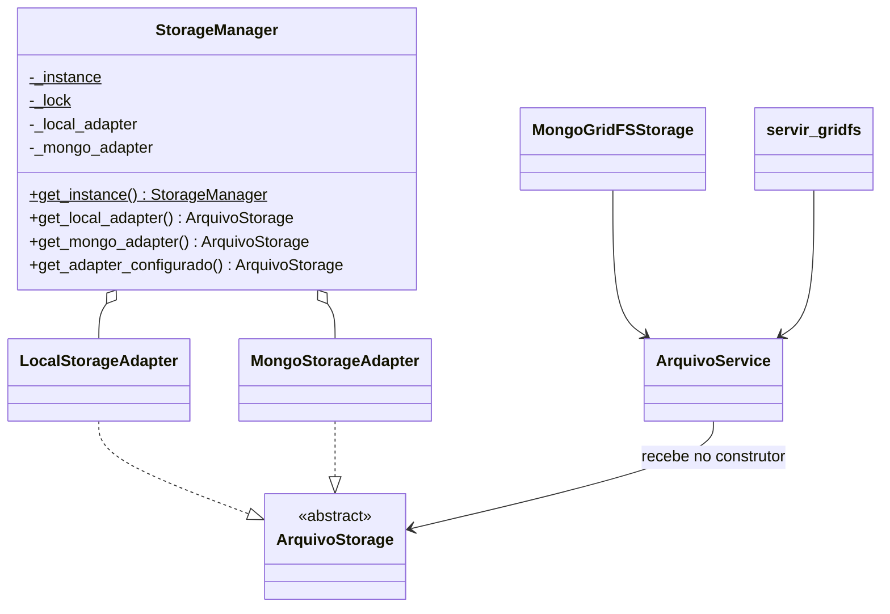

# Singleton no app `storage`

Este documento compara o Singleton do app `storage` com a referência de sala (`docs/ref/DatabaseManager.java` e `docs/ref/Main.java`) e registra o que foi alterado para o projeto seguir a mesma estrutura.

> A pasta `docs/ref/` fica apenas na máquina local (está no `.gitignore`). Por isso os trechos da referência aparecem copiados aqui.
>
> Veja também: [Adapter no app `storage`](adapter-storage.md) e a [visão geral](README.md).

**Status:** implementado. As seções 2 e 3 descrevem o estado **anterior** (com `storage/factory.py`) e ficam como registro da análise.

---

## 1. O Singleton na referência

```java
public class DatabaseManager {
    private static DatabaseManager instance;

    private final DataBaseAdapter postgresAdapter;
    private final DataBaseAdapter mongoAdapter;

    private DatabaseManager() {
        PostgresClient postgresClient = new PostgresClient("localhost", 5432, "usuarios_db");
        MongoClient mongoClient = new MongoClient("localhost", 27017, "auditoria_db");

        postgresAdapter = new PostgresAdapter(postgresClient);
        mongoAdapter = new MongoAdapter(mongoClient);
    }

    public static DatabaseManager getInstance() {
        if (instance == null) {
            instance = new DatabaseManager();
        }
        return instance;
    }

    public DataBaseAdapter getPostgresAdapter() { return postgresAdapter; }
    public DataBaseAdapter getMongoAdapter()    { return mongoAdapter; }
}
```

Uso em `Main.java`:

```java
DatabaseManager databaseManager = DatabaseManager.getInstance();
UsuarioService usuarioNoPostgres = new UsuarioService(databaseManager.getPostgresAdapter());
UsuarioService auditoriaNoMongo  = new UsuarioService(databaseManager.getMongoAdapter());
```

### Características que definem o padrão na referência

| # | Característica | Onde aparece |
|---|---|---|
| R1 | Existe uma **classe dedicada** que é o Singleton | `DatabaseManager` |
| R2 | A instância fica em um **atributo estático da classe** | `private static DatabaseManager instance` |
| R3 | O **construtor é privado**: ninguém de fora consegue criar outra instância | `private DatabaseManager()` |
| R4 | O acesso é feito por um **método estático de obtenção** | `getInstance()` |
| R5 | A instância é criada **no primeiro uso** (inicialização preguiçosa) | `if (instance == null)` |
| R6 | Depois de criada, a instância **nunca é trocada** | não há setter nem reset |
| R7 | O Singleton é um **gerenciador que contém os adapters**, e não o adapter em si | campos `postgresAdapter` e `mongoAdapter` |
| R8 | O gerenciador **expõe cada adapter por um getter** | `getPostgresAdapter()`, `getMongoAdapter()` |
| R9 | O **service recebe o adapter pronto** pelo construtor (injeção de dependência) | `new UsuarioService(adapter)` |

---

## 2. Como o app `storage` estava antes

O "Singleton" ficava em `storage/factory.py` (arquivo removido):

```python
def criar_storage():
    global _instancia, _configuracao
    tipo = settings.FILE_STORAGE
    configuracao = (tipo, MONGO_URI, MONGO_DATABASE, MEDIA_ROOT)
    with _lock:
        if _instancia is not None and _configuracao == configuracao:
            return _instancia
        if _instancia is not None and hasattr(_instancia, "close"):
            _instancia.close()
        if tipo == "mongo":
            _instancia = MongoStorageAdapter(...)
        elif tipo == "local":
            _instancia = LocalStorageAdapter()
        else:
            raise ValueError(...)
        _configuracao = configuracao
        return _instancia

criar_storage.cache_clear = _limpar_storage
```

Quem usava:

| Arquivo | Uso |
|---|---|
| `storage/service.py` | `ArquivoService(storage=None)`: se não recebesse um storage, chamava `criar_storage()` |
| `storage/mongo_django.py` | `MongoGridFSStorage` chamava `criar_storage()` em cada operação |
| `storage/views.py` | `servir_gridfs` chamava `criar_storage().buscar(...)` |
| `core/tests.py` | Testava `criar_storage() is criar_storage()` e usava `cache_clear()` |

---

## 3. Comparação com a referência (estado anterior)

| # | Referência | `storage` antes | Situação |
|---|---|---|---|
| R1 | Classe `DatabaseManager` | Não havia classe; era a função `criar_storage()` com variáveis globais | ❌ Divergia |
| R2 | `private static instance` | `_instancia` global no módulo | ✅ Equivalente |
| R3 | Construtor privado | Não havia gerenciador para proteger | ❌ Divergia |
| R4 | `getInstance()` | `criar_storage()`: o nome sugere que **cria** algo (Factory), e não que **obtém** a instância | ⚠️ Nome enganava |
| R5 | Criação no primeiro uso | Criava na primeira chamada | ✅ Equivalente |
| R6 | Instância nunca muda | **Podia ser trocada** quando o settings mudava. Também existia `cache_clear()` | ❌ Divergia |
| R7 | Singleton é o gerenciador | Singleton era o **próprio adapter**, um só de cada vez | ❌ Divergia |
| R8 | Getters para cada adapter | Não tinha | ❌ Divergia |
| R9 | Service recebe o adapter pronto | Recebia, mas buscava sozinho se não recebesse | ⚠️ Parcial |
| — | Não é thread-safe | Usava `RLock` | ➕ Ia além da referência |

**Conclusão:** o app tinha o **efeito** de um Singleton, mas a estrutura era de uma **Factory com cache de instância**.

---

## 4. O que foi feito

### 4.1 Estrutura final



| Referência (Java) | Projeto (Python) |
|---|---|
| `DatabaseManager` | `StorageManager` ([`storage/manager.py`](../storage/manager.py)) |
| `getInstance()` | `StorageManager.get_instance()` |
| `getPostgresAdapter()` | `get_local_adapter()` |
| `getMongoAdapter()` | `get_mongo_adapter()` |
| `UsuarioService` | `ArquivoService` ([`storage/service.py`](../storage/service.py)) |
| `Main` | `mongo_django.py`, `views.py` e quem mais usar o storage |

### 4.2 `storage/manager.py`

```python
class StorageManager:
    """Singleton que guarda os adapters de armazenamento de arquivos."""

    _instance = None
    _lock = Lock()

    def __new__(cls, *args, **kwargs):
        # Equivalente ao construtor privado: a unica forma de obter o objeto e get_instance().
        raise TypeError("Use StorageManager.get_instance()")

    @classmethod
    def get_instance(cls):
        if cls._instance is None:
            with cls._lock:
                if cls._instance is None:
                    instancia = super().__new__(cls)
                    mongo_client = MongoClient(settings.MONGO_URI)

                    instancia._local_adapter = LocalStorageAdapter(settings.MEDIA_ROOT)
                    instancia._mongo_adapter = MongoStorageAdapter(
                        mongo_client,
                        database_name=settings.MONGO_DATABASE,
                    )
                    cls._instance = instancia
        return cls._instance

    def get_local_adapter(self):
        return self._local_adapter

    def get_mongo_adapter(self):
        return self._mongo_adapter

    def get_adapter_configurado(self):
        """Devolve o adapter escolhido em FILE_STORAGE."""
        ...
```

Como cada item foi atendido:

- **Construtor privado (R3):** Python não tem `private`. O `__new__` lança erro, então `StorageManager()` falha. Só `get_instance()` cria o objeto, chamando `super().__new__` direto.
- **Instância estática (R2) e criação no primeiro uso (R5):** `_instance` é atributo de classe e só é preenchido na primeira chamada.
- **Thread-safety:** o `Lock` com verificação dupla (*double-checked locking*) mantém a proteção que o `factory.py` já tinha. A referência não trata isso, mas no Django com várias threads é necessário.
- **Instância imutável (R6):** não existe método que troque ou recrie a instância.
- **Gerenciador com os adapters (R7, R8):** assim como o `DatabaseManager`, o manager cria os *clients* (`MongoClient`, diretório `MEDIA_ROOT`) e os injeta nos adapters. Detalhes em [adapter-storage.md](adapter-storage.md).
- **`get_adapter_configurado()`:** não existe na referência. Existe para continuar respeitando `FILE_STORAGE`.

> **Criar o adapter Mongo mesmo com `FILE_STORAGE=local` é seguro?**
> Sim. O `MongoClient` do `pymongo` não abre conexão no construtor, só na primeira operação. Com o Mongo desligado a aplicação sobe normalmente.

### 4.3 Service recebe o adapter pronto (R9)

`ArquivoService(storage)` agora exige o adapter no construtor. Uso, no mesmo formato do `Main.java`:

```python
manager = StorageManager.get_instance()
arquivos_locais = ArquivoService(manager.get_local_adapter())
arquivos_mongo  = ArquivoService(manager.get_mongo_adapter())
```

### 4.4 Quem usava `criar_storage()`

- `storage/mongo_django.py` e `storage/views.py` passaram a usar `ArquivoService(StorageManager.get_instance().get_mongo_adapter())`.
- `storage/factory.py` foi **removido**. Assim sobra um único ponto de acesso, e o `cache_clear()`, que permitia trocar a instância, deixou de existir.

### 4.5 Testes

Em [`core/tests.py`](../core/tests.py), a classe `StorageManagerTests` verifica:

- `get_instance()` sempre devolve o mesmo objeto;
- `StorageManager()` lança `TypeError`;
- o `MongoClient` e o adapter Mongo são criados uma única vez, com o client injetado;
- o adapter local recebe o `MEDIA_ROOT`;
- o service recebe o adapter do manager;
- `get_adapter_configurado()` segue `FILE_STORAGE`.

`StorageManager._instance = None` aparece **só nos testes**, para isolar um teste do outro. Não é uma API de reset da aplicação.

### 4.6 Mudança de comportamento

Antes, mudar `FILE_STORAGE`, `MONGO_URI`, `MONGO_DATABASE` ou `MEDIA_ROOT` com a aplicação rodando fazia a factory recriar a instância. Agora a instância é fixa, como exige o padrão. Mudanças nessas configurações só valem depois de reiniciar a aplicação.

---

## 5. Checklist de conformidade

| # | Característica da referência | Como ficou no projeto |
|---|---|---|
| R1 | Classe dedicada | `StorageManager` |
| R2 | Instância estática | `StorageManager._instance` |
| R3 | Construtor privado | `__new__` lança `TypeError` |
| R4 | Método de obtenção | `StorageManager.get_instance()` |
| R5 | Criação no primeiro uso | `if cls._instance is None` |
| R6 | Instância nunca muda | sem reset ou troca (`factory.py` removido) |
| R7 | Gerenciador contém os adapters | `_local_adapter` e `_mongo_adapter` |
| R8 | Getters por adapter | `get_local_adapter()` e `get_mongo_adapter()` |
| R9 | Service recebe o adapter | `ArquivoService(adapter)` obrigatório |
