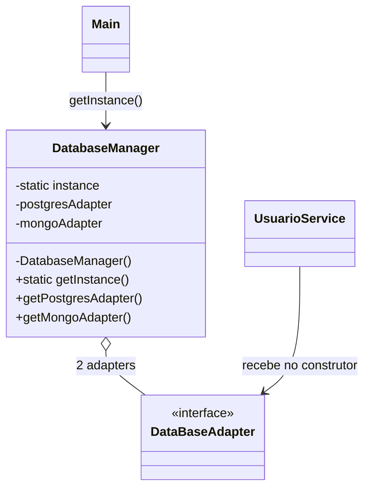
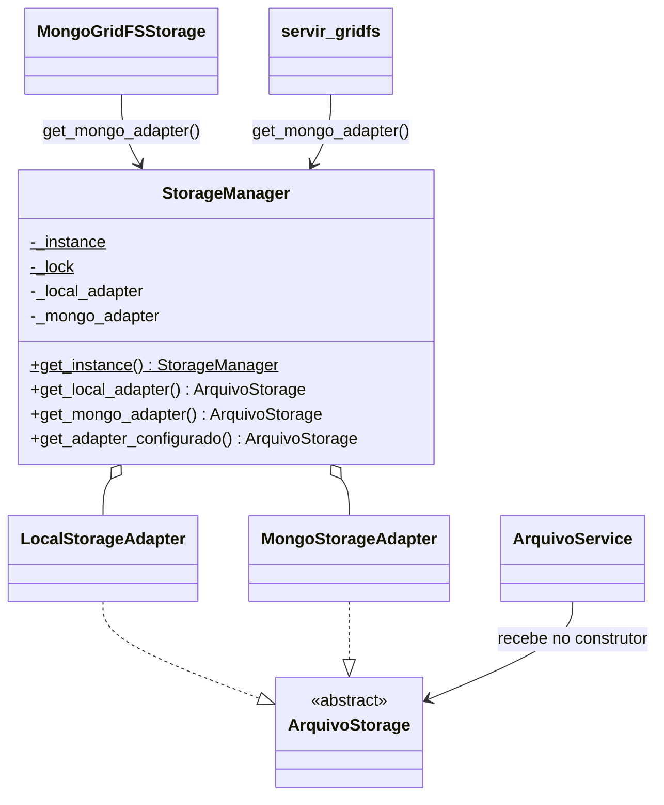

# Singleton no app `storage`

Este documento compara o Singleton implementado no app `storage` com a referência em [`docs/ref`](ref/) e descreve o que precisa mudar para que o projeto siga a mesma estrutura.

> **Status:** o ajuste descrito na seção 4 já foi implementado. As seções 2 e 3 descrevem o estado **anterior** (com `storage/factory.py`), mantidas como registro da análise.

---

## 1. O Singleton na referência

O Singleton da referência está em [`DatabaseManager.java`](ref/DatabaseManager.java):

```java
public class DatabaseManager {
    private static DatabaseManager instance;

    private final DataBaseAdapter postgresAdapter;
    private final DataBaseAdapter mongoAdapter;

    private DatabaseManager() { /* cria clients e adapters */ }

    public static DatabaseManager getInstance() {
        if (instance == null) {
            instance = new DatabaseManager();
        }
        return instance;
    }

    public DataBaseAdapter getPostgresAdapter() { return postgresAdapter; }
    public DataBaseAdapter getMongoAdapter()    { return mongoAdapter; }
}
```

E é usado assim em [`Main.java`](ref/Main.java):

```java
DatabaseManager databaseManager = DatabaseManager.getInstance();
UsuarioService usuarioNoPostgres = new UsuarioService(databaseManager.getPostgresAdapter());
UsuarioService auditoriaNoMongo  = new UsuarioService(databaseManager.getMongoAdapter());
```

### Características que definem o padrão na referência

| # | Característica | Onde aparece |
|---|---|---|
| R1 | Existe uma **classe dedicada** que é o Singleton | `DatabaseManager` |
| R2 | A instância fica em um **atributo estático da classe** | `private static DatabaseManager instance` |
| R3 | O **construtor é privado**: ninguém de fora consegue criar outra instância | `private DatabaseManager()` |
| R4 | O acesso é feito por um **método estático de obtenção** | `getInstance()` |
| R5 | A instância é criada **no primeiro uso** (inicialização preguiçosa) | `if (instance == null)` |
| R6 | Depois de criada, a instância **nunca é trocada** | não há setter nem reset |
| R7 | O Singleton é um **gerenciador que contém os adapters**, e não o adapter em si | campos `postgresAdapter` e `mongoAdapter` |
| R8 | O gerenciador **expõe cada adapter por um getter** | `getPostgresAdapter()`, `getMongoAdapter()` |
| R9 | O **service recebe o adapter pronto** pelo construtor (injeção de dependência) | `new UsuarioService(adapter)` |



---

## 2. Como o app `storage` está hoje

O "Singleton" do projeto está em [`storage/factory.py`](../storage/factory.py):

```python
def criar_storage():
    """Retorna uma unica instancia por configuracao, com inicializacao sincronizada."""
    global _instancia, _configuracao
    tipo = settings.FILE_STORAGE
    configuracao = (tipo, MONGO_URI, MONGO_DATABASE, MEDIA_ROOT)
    with _lock:
        if _instancia is not None and _configuracao == configuracao:
            return _instancia
        if _instancia is not None and hasattr(_instancia, "close"):
            _instancia.close()
        if tipo == "mongo":
            _instancia = MongoStorageAdapter(...)
        elif tipo == "local":
            _instancia = LocalStorageAdapter()
        else:
            raise ValueError(...)
        _configuracao = configuracao
        return _instancia

_lock = RLock()
_instancia = None
_configuracao = None
criar_storage.cache_clear = _limpar_storage
```

Quem chama esse código:

| Arquivo | Uso |
|---|---|
| [`storage/service.py`](../storage/service.py) | `ArquivoService(storage=None)`: se não receber um storage, chama `criar_storage()` |
| [`storage/mongo_django.py`](../storage/mongo_django.py) | `MongoGridFSStorage` (backend Django para `ImageField`/`FileField`) chama `criar_storage()` em cada operação |
| [`storage/views.py`](../storage/views.py) | `servir_gridfs` chama `criar_storage().buscar(...)` |
| [`core/tests.py`](../core/tests.py) | Testa se `criar_storage() is criar_storage()` e usa `criar_storage.cache_clear()` |

A escolha entre local e Mongo vem de [`digicar/settings.py`](../digicar/settings.py) (`FILE_STORAGE`, `MONGO_URI`, `MONGO_DATABASE`, `MEDIA_ROOT`).

---

## 3. Comparação ponto a ponto

| # | Referência | `storage` hoje | Situação |
|---|---|---|---|
| R1 | Classe `DatabaseManager` | Não há classe; é a função `criar_storage()` com variáveis globais do módulo | ❌ Diverge |
| R2 | `private static instance` | `_instancia` global no módulo | ✅ Equivalente |
| R3 | Construtor privado | Nada impede `MongoStorageAdapter(...)` ou `LocalStorageAdapter()` de serem criados livremente | ❌ Diverge |
| R4 | `getInstance()` | `criar_storage()`: o nome sugere que **cria** algo (Factory), e não que **obtém** a instância única | ⚠️ Nome engana |
| R5 | Criação no primeiro uso | Cria na primeira chamada | ✅ Equivalente |
| R6 | Instância nunca muda | **Pode ser trocada**: se `FILE_STORAGE`, `MONGO_URI`, `MONGO_DATABASE` ou `MEDIA_ROOT` mudarem, a instância antiga é fechada e outra é criada. Também existe `cache_clear()` | ❌ Diverge |
| R7 | Singleton é o gerenciador | Singleton é o **próprio adapter**, um só de cada vez | ❌ Diverge |
| R8 | Getters para cada adapter | Não tem. Devolve só o adapter configurado | ❌ Diverge |
| R9 | Service recebe o adapter pronto | `ArquivoService` aceita o adapter, mas se não receber busca sozinho com `criar_storage()` | ⚠️ Parcial |
| — | Não é thread-safe | Usa `RLock` | ➕ Vai além da referência |

### Conclusão

O app `storage` consegue o **efeito** de um Singleton (uma única instância compartilhada e criada no primeiro uso), mas **não segue a estrutura** da referência. Na prática é uma **Factory com cache de instância**: escolhe o adapter a partir do settings e guarda o resultado.

Os três pontos que mais afastam o projeto da referência:

1. **Não existe uma classe gerenciadora com `get_instance()`** (R1, R3, R4).
2. **A instância pode ser trocada** enquanto a aplicação roda (R6).
3. **O objeto único é o adapter, e não um gerenciador que contém os adapters** (R7, R8).

---

## 4. Como ajustar para ficar de acordo com a referência

### 4.1 Visão geral da mudança



Correspondência com a referência:

| Referência (Java) | Projeto (Python) |
|---|---|
| `DatabaseManager` | `StorageManager` |
| `getInstance()` | `StorageManager.get_instance()` |
| `getPostgresAdapter()` | `get_local_adapter()` |
| `getMongoAdapter()` | `get_mongo_adapter()` |
| `DataBaseAdapter` | `ArquivoStorage` ([`storage/interfaces.py`](../storage/interfaces.py)) |
| `PostgresAdapter` / `MongoAdapter` | `LocalStorageAdapter` / `MongoStorageAdapter` |
| `UsuarioService` | `ArquivoService` |
| `Main` | `views.py`, `mongo_django.py` e quem mais usar o storage |

### 4.2 Passo 1: criar `storage/manager.py`

Novo arquivo com a classe Singleton. Ele cumpre R1 a R8:

```python
from threading import Lock

from django.conf import settings

from .local_adapter import LocalStorageAdapter
from .mongo_adapter import MongoStorageAdapter


class StorageManager:
    """Singleton que guarda os adapters de armazenamento de arquivos."""

    _instance = None
    _lock = Lock()

    def __new__(cls, *args, **kwargs):
        # Equivalente ao construtor privado da referência.
        raise TypeError("Use StorageManager.get_instance()")

    @classmethod
    def get_instance(cls):
        if cls._instance is None:
            with cls._lock:
                if cls._instance is None:
                    instancia = super().__new__(cls)
                    instancia._local_adapter = LocalStorageAdapter()
                    instancia._mongo_adapter = MongoStorageAdapter(
                        connection_string=settings.MONGO_URI,
                        database_name=settings.MONGO_DATABASE,
                    )
                    cls._instance = instancia
        return cls._instance

    def get_local_adapter(self):
        return self._local_adapter

    def get_mongo_adapter(self):
        return self._mongo_adapter

    def get_adapter_configurado(self):
        """Devolve o adapter escolhido em FILE_STORAGE."""
        if settings.FILE_STORAGE == "mongo":
            return self._mongo_adapter
        if settings.FILE_STORAGE == "local":
            return self._local_adapter
        raise ValueError("FILE_STORAGE inválido. Use 'local' ou 'mongo'.")
```

Como cada item foi atendido:

- **Construtor privado (R3):** Python não tem `private`. Fazer `__new__` lançar erro impede `StorageManager()` de fora, e só `get_instance()` cria o objeto (com `super().__new__`).
- **Instância estática (R2) e criação no primeiro uso (R5):** `_instance` é atributo de classe e só é preenchido na primeira chamada.
- **Thread-safety:** o `Lock` com verificação dupla (*double-checked locking*) mantém a vantagem que o `factory.py` já tinha. A referência não trata isso, mas no Django com vários workers/threads é necessário.
- **Instância imutável (R6):** não existe método que troque ou recrie a instância.
- **Dois adapters no gerenciador (R7, R8):** igual à referência, que cria Postgres e Mongo no construtor.
- **`get_adapter_configurado()`:** não existe na referência. Ele existe para manter o comportamento atual do projeto, em que `FILE_STORAGE` decide qual storage é o padrão.

> **Criar o `MongoStorageAdapter` mesmo com `FILE_STORAGE=local` é seguro?**
> Sim. O `MongoClient` do `pymongo` não abre conexão no construtor, só na primeira operação. Com Mongo desligado, a aplicação sobe normalmente e só falharia se alguém realmente usasse o adapter Mongo.

### 4.3 Passo 2: `ArquivoService` recebe o adapter obrigatório

Em [`storage/service.py`](../storage/service.py), tirar o fallback para `criar_storage()`. O service passa a receber sempre o adapter, como o `UsuarioService` da referência (R9):

```python
from .interfaces import ArquivoStorage


class ArquivoService:

    def __init__(self, storage: ArquivoStorage):
        self.storage = storage
    # ... métodos salvar/buscar/excluir/existe sem mudança
```

Uso, no mesmo formato do `Main.java`:

```python
from storage.manager import StorageManager
from storage.service import ArquivoService

manager = StorageManager.get_instance()
arquivos_locais = ArquivoService(manager.get_local_adapter())
arquivos_mongo  = ArquivoService(manager.get_mongo_adapter())
```

### 4.4 Passo 3: trocar `criar_storage()` pelo manager

Estes dois arquivos só existem para o GridFS, então pedem o adapter Mongo explicitamente.

[`storage/mongo_django.py`](../storage/mongo_django.py):

```python
from .manager import StorageManager


class MongoGridFSStorage(Storage):
    def _adapter(self):
        return StorageManager.get_instance().get_mongo_adapter()

    def _open(self, name, mode="rb"):
        return ContentFile(self._adapter().buscar(name), name=name)

    def _save(self, name, content):
        return self._adapter().salvar(name, b"".join(content.chunks()))

    def delete(self, name):
        self._adapter().excluir(name)

    def exists(self, name):
        return self._adapter().existe(name)
    # url() sem mudança
```

[`storage/views.py`](../storage/views.py):

```python
from .manager import StorageManager


@require_GET
def servir_gridfs(request, identificador):
    try:
        conteudo = StorageManager.get_instance().get_mongo_adapter().buscar(identificador)
    except (FileNotFoundError, ValueError):
        raise Http404("Arquivo não encontrado")
    ...
```

### 4.5 Passo 4: remover `storage/factory.py`

Depois dos passos 2 e 3 ninguém mais usa `criar_storage()`. Apagar o arquivo evita ter **dois pontos de acesso** ao storage, o que contradiz a ideia de instância única. Também sai o `criar_storage.cache_clear`, que permitia trocar a instância (R6).

Confirmar antes que não sobrou referência:

```bash
grep -rn "criar_storage\|storage.factory" --include=*.py .
```

### 4.6 Passo 5: ajustar os testes em `core/tests.py`

A classe `ArquivoStorageTests` ([`core/tests.py`](../core/tests.py)) testa a factory. Ela passaria a testar o manager:

```python
from unittest.mock import patch

from storage.manager import StorageManager
from storage.service import ArquivoService


class StorageManagerTests(SimpleTestCase):
    def setUp(self):
        StorageManager._instance = None   # apenas para isolar os testes

    def tearDown(self):
        StorageManager._instance = None

    @patch("storage.manager.MongoStorageAdapter")
    def test_get_instance_retorna_sempre_o_mesmo_objeto(self, _):
        self.assertIs(StorageManager.get_instance(), StorageManager.get_instance())

    def test_construtor_direto_e_bloqueado(self):
        with self.assertRaises(TypeError):
            StorageManager()

    @override_settings(MONGO_URI="mongodb://mongo:27017", MONGO_DATABASE="arquivos")
    @patch("storage.manager.MongoStorageAdapter")
    def test_mongo_adapter_criado_uma_vez(self, adapter):
        StorageManager.get_instance()
        StorageManager.get_instance()

        adapter.assert_called_once_with(
            connection_string="mongodb://mongo:27017",
            database_name="arquivos",
        )

    @patch("storage.manager.MongoStorageAdapter")
    def test_service_recebe_adapter_do_manager(self, _):
        manager = StorageManager.get_instance()
        service = ArquivoService(manager.get_local_adapter())

        self.assertIs(service.storage, manager.get_local_adapter())
```

`StorageManager._instance = None` só aparece nos testes, para que um teste não interfira no outro. **Não** é uma API pública de reset e não deve ser usado no código da aplicação.

O teste `test_adapter_local_salva_busca_e_exclui` não muda, porque usa `LocalStorageAdapter` direto.

### 4.7 Passo 6: atualizar o README

Na seção de uploads do [`README.MD`](../README.MD), citar que o acesso ao storage é feito por `StorageManager.get_instance()` e que `FILE_STORAGE` continua escolhendo o backend padrão.

---

## 5. Checklist de conformidade depois do ajuste

| # | Característica da referência | Como fica no projeto |
|---|---|---|
| R1 | Classe dedicada | `StorageManager` |
| R2 | Instância estática | `StorageManager._instance` |
| R3 | Construtor privado | `__new__` lança `TypeError` |
| R4 | Método de obtenção | `StorageManager.get_instance()` |
| R5 | Criação no primeiro uso | `if cls._instance is None` |
| R6 | Instância nunca muda | sem reset ou troca (`factory.py` removido) |
| R7 | Gerenciador contém os adapters | `_local_adapter` e `_mongo_adapter` |
| R8 | Getters por adapter | `get_local_adapter()` e `get_mongo_adapter()` |
| R9 | Service recebe o adapter | `ArquivoService(adapter)` obrigatório |

## 6. Arquivos afetados

| Arquivo | Ação |
|---|---|
| `storage/manager.py` | **Criar** |
| `storage/service.py` | Alterar: adapter obrigatório no construtor |
| `storage/mongo_django.py` | Alterar: usar `StorageManager` |
| `storage/views.py` | Alterar: usar `StorageManager` |
| `storage/factory.py` | **Remover** |
| `core/tests.py` | Alterar: testes do manager no lugar dos testes da factory |
| `README.MD` | Alterar: citar o `StorageManager` |

## 7. Fora do escopo do Singleton

A interface da referência ([`DataBaseAdapter.java`](ref/DataBaseAdapter.java)) tem `conectar()` e `desconectar()`, e o `UsuarioService` chama os dois em volta de cada operação. A interface [`ArquivoStorage`](../storage/interfaces.py) não tem esses métodos. Essa diferença é do padrão **Adapter**, não do Singleton, e fica para outra análise.
